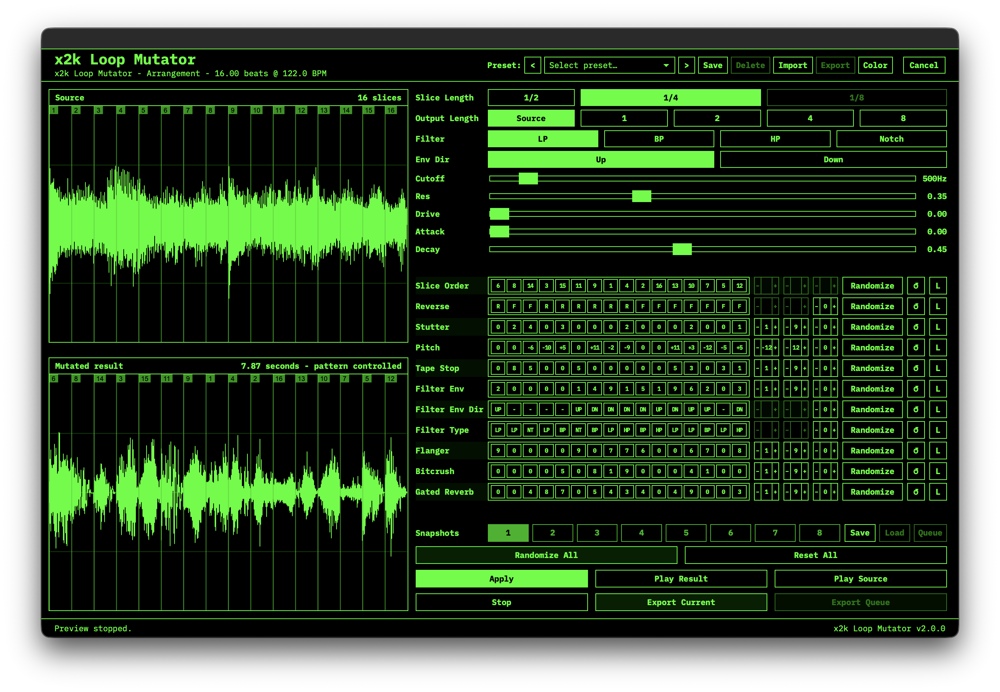

# x2k Loop Mutator

**x2k Loop Mutator** is an Ableton Live Extension that turns a selected audio clip into pattern-controlled loop mutations.



Open it from an audio clip in Arrangement View, slice the source on a musical grid, edit per-effect pattern lanes, preview the mutation, then export the current render or a queued set of snapshots back into Live on a new `x2k Loop Mutator` audio track.

## What it does

x2k Loop Mutator is built for fast loop mangling while keeping the original material intact. It renders the selected clip, shows both the source and mutated result as waveforms, and lets you drive each effect with step-based patterns.

The extension supports short loop material up to **4 bars / 16 beats**. If a selected clip is longer, the editor shows a warning and asks you to crop or consolidate the clip before mutating it.

## Features

- Opens from the **Mutate Loop** context menu on Arrangement View audio clips
- Currently supports **Arrangement View audio clips only**
- Source and mutated waveform displays with playhead preview
- Slice Length options: **1/2**, **1/4**, and **1/8** notes
- Output Length options: **Source**, **1**, **2**, **4**, or **8** bars
- Pattern-controlled lanes for:
  - Slice Order
  - Reverse
  - Stutter
  - Pitch
  - Tape Stop
  - Filter
  - Flanger
  - Bitcrush
  - Gated Reverb
- Compact pattern chip display with editable text input per lane
- Pattern validation with normalization to the active slice count
- Per-lane randomization controls for **Min**, **Max**, and **Freq**
- `Randomize All`, per-lane randomize, per-lane reset, and global reset controls
- Multimode SVF filter with **LP**, **BP**, **HP**, and **Notch** modes
- Filter controls for **Cutoff**, **Resonance**, **Drive**, **Attack**, **Decay**, and envelope direction
- 8 snapshot slots with save, load, and queue actions
- Export Current render or Export Queue for batch-rendered snapshots
- Automatic import of rendered files back into the Live project
- Exports stereo **48 kHz / 24-bit WAV** files
- Duplicates the source track, clears the duplicate, and writes the mutated clips to a new track named `x2k Loop Mutator`
- Preserves the original source clip and track

## Workflow

1. Select an audio clip in Arrangement View in Ableton Live.
2. Right-click the clip and choose **Mutate Loop**.
3. Pick a **Slice Length** and **Output Length**.
4. Edit the pattern lanes or use **Randomize All**.
5. Press **Apply** to render the current mutation in the editor.
6. Preview the source or mutated result with **Play Source** and **Play Result**.
7. Use **Export Current** to send the current mutation back to Live.
8. Optionally save several snapshots, queue them, and use **Export Queue** to batch export them.

## Pattern lanes

Most lanes use values from `0` to `9`:

- `0` usually means no effect for that step.
- Higher values increase the intensity of the effect.
- Patterns repeat automatically to match the active number of slices.

Special lanes:

- **Slice Order** uses slice numbers, for example `1-3-2-4`.
- **Reverse** uses `F` and `R` for forward and reverse playback.
- **Pitch** uses semitone values from `-12` to `+12`.

Supported separators include dashes, commas, spaces, and slashes depending on the lane. The editor normalizes valid patterns after editing.

## Randomization

Each pattern lane has randomization controls:

- **Min**: lowest value used when randomizing the lane
- **Max**: highest value used when randomizing the lane
- **Freq**: how many steps should receive randomized values

When **Freq** is empty or `0`, all steps of the lane are randomized broadly. Set **Freq** to a lower value for sparser mutations where only some steps change.

Notes:

- Slice Order randomizes by shuffling slices.
- Reverse uses forward/reverse values instead of numeric Min/Max.
- Pitch randomization is clamped to `-12` through `+12` semitones.

## Export behavior

When exporting, x2k Loop Mutator writes a temporary WAV file, imports it into the Live project, and creates new clips on a duplicated audio track named `x2k Loop Mutator`.

Exported clips are placed from the Arrangement source clip's start position, and queued renders are laid out sequentially.

## Supported source audio

The extension can decode common WAV and AIFF/AIFC source files, including PCM and floating-point variants supported by the internal decoder. Audio is converted to stereo and resampled to **48 kHz** when needed.

## Limits and notes

- Maximum source length: **16 beats / 4 bars**
- Maximum generated slice count: **16 slices**
- x2k Loop Mutator currently supports Arrangement View audio clips only. It does not register a context-menu action for Session View clips.
- The selected clip must contain audible audio
- Exports are stereo 24-bit WAV files
- The original clip and track are not modified

## Requirements

- macOS with [Ableton Live](https://www.ableton.com/live/) and support for Live Extensions
- [Node.js](https://nodejs.org) >= 24.14 and npm
- The Ableton Live Extensions SDK and CLI (see below)

## Get the Ableton Extensions SDK & CLI

x2k Loop Mutator builds against Ableton's Live Extensions SDK and packages with the matching CLI. These components are distributed by Ableton to beta participants and **cannot be redistributed here**, so they are not part of this repository.

1. Obtain the Live Extensions SDK and CLI tarballs through Ableton's Live Extensions beta program.
2. Place both archives in a `vendor/` directory at the project root, keeping the exact file names:

```text
vendor/
├── ableton-extensions-sdk-1.0.0-beta.1.tgz
└── ableton-extensions-cli-1.0.0-beta.1.tgz
```

`package.json` references these tarballs directly (`file:` dependencies), so `npm install` will not succeed without them. If Ableton ships newer versions, update the `file:` paths in `package.json` to match.

## Build from source

```sh
git clone https://github.com/x2k77m1/x2k-loop-mutator.git
cd x2k-loop-mutator
# place the SDK + CLI tarballs in vendor/ (see above)
npm install
cp .env.example .env   # then set EXTENSION_HOST_PATH for your Live install
```

The path to Ableton Live's Extension Host module is stored in `.env` as `EXTENSION_HOST_PATH`. Edit it if your install moves.

## Installing a release build

Prebuilt `.ablx` files are attached to each [GitHub release](https://github.com/x2k77m1/x2k-loop-mutator/releases). Download one and drop it into the Extensions page in Live's settings — no build tools required.

## Scripts

```sh
npm start                  # build + run in Live's Extension Host
npm run build              # production bundle of src/extension.ts
npm run build:dev          # dev bundle with sourcemaps, not minified
npm run package            # production build + .ablx archive
```

## Architecture notes

- `src/extension.ts` owns activation, clip selection, and modal orchestration.
- `src/host/` runs inside Live's Extension Host: source rendering, timing models, WAV encoding/metadata, export placement, preset persistence.
- `src/editor/runtime/` is real TypeScript compiled by esbuild into a browser IIFE that is embedded into the generated editor HTML (`core.ts` holds pure pattern/DSP logic; `main.ts` owns DOM state and wiring).
- `src/shared/` contains code used by both sides: types, runtime validation, factory presets, slice-mode constants, the int16 bridge codec, and the displayed version string.

## License

Released under the [MIT License](LICENSE). Ableton and the Live Extensions SDK/CLI are products of Ableton AG and are not distributed with this repository.
